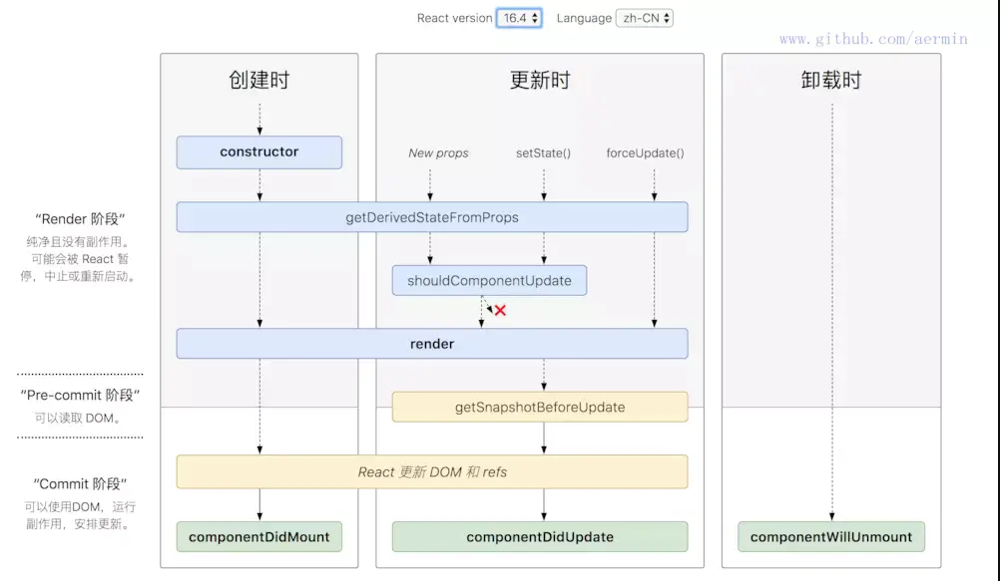

# react_learn

## tip

引入ts后腰注意下载ts的react,react-dom

react事件都是事件委托

## 非受控组件\受控组件

表单中所有输入类的dom，现用现取称为非受控组件

```js
import React from 'react'

class demo extends React.Component{
  
  handleSubmit = (e) => {
    e.preventDefault()
    const {username, password} = this
    console.log(`username: ${username.value},password: ${password.value}`)
  }

  render() {
    return(
      <form onSubmit={this.handleSubmit}>
        用户名<input ref={c => this.username = c} type='text' name='username' />
        密码<input ref={c => this.password = c} type='password' name='password' />
        <button>登录</button>
      </form>
    )
  }
}
export default demo
```

表单中随着我的输入修改state状态，称为受控组件(可以减少ref的使用)

```js
import React from 'react'

class demo extends React.Component{
  state = {
    username: '',
    password: ''
  }

  saveUsername = (e) => {
    this.setState({
      username: e.target.value
    })
  }

  savePassword = (e) => {
    this.setState({
      password: e.target.value
    })
  }
  
  handleSubmit = (e) => {
    e.preventDefault()
    const {username, password} = this.state
    console.log(`username: ${username},password: ${password}`)
  }

  render() {
    return(
      <form onSubmit={this.handleSubmit}>
        用户名<input onChange={this.saveUsername} type='text' name='username' />
        密码<input onChange={this.savePassword} type='password' name='password' />
        <button>登录</button>
      </form>
    )
  }
}
export default demo
```

## 高阶函数-函数柯里化

如果一个函数满足下面两个规范任何一个就是高阶函数
1、若A函数，接收的参数是一个函数，那么A就可以称为高阶函数
2、若A函数，调用的返回值依然是一个函数，那么A就可以称为高阶函数

常见的高阶函数：promise、setTimeout、arr.map()

```js
import React from 'react'

class demo extends React.Component{
  
  saveFormData = (dataType) => {
    return (e) => {
      this.setState({[dataType]: e.target.value})
    }
  }

  handleSubmit = (e) => {
    e.preventDefault()
    const {username, password} = this
    console.log(`username: ${username.value},password: ${password.value}`)
  }

  render() {
    return(
      <form onSubmit={this.handleSubmit}>
        用户名<input onChange={this.saveFormData('username')} type='text' name='username' />
        密码<input onChange={this.saveFormData('password')} type='password' name='password' />
        <button>登录</button>
      </form>
    )
  }
}
export default demo
```

函数的柯里化：通过函数调用继续返回函数的方式，实现多次接收参数最后统一处理的函数编码形式

## 生命周期



初始化阶段：由ReactDom.render()触发--初次渲染

1. construct()
2. getDerivedStateFromProps
3. render()
4. componentDidMount()

根新阶段：由组件内部this.setState()或父组件重新render()

1. getDerivedStateFromProps
2. shouldCompinentUpdate()
3. render()
4. getSnapshostBeforeUpdate
5. componentDidUpdate()

卸载组件：由ReactDom.unmountComponentAtNode()触发

1. compinentWillUnmount()

tip: 


1. 挂载时componentDidMount

组件第一次渲染完成，此时dom节点已经生成，可以在这里调用ajax请求，返回数据setState后组件会重新渲染

2. 更新时componentDidUpdate

组件更新完毕后，react只会在第一次初始化成功会进入componentDidmount,之后每次重新渲染后都会进入这个生命周期，这里可以拿到prevProps和prevState，即更新前的props和state。

3. 卸载时componentDidUnmount

在此处完成组件的卸载和数据的销毁。

clear你在组建中所有的setTimeout,setInterval移除所有组建中的监听 removeEventListener

## key

当状态中的数据发生变化时，react会根据新数据生成新的虚拟dom，随后react进行新的虚拟dom和旧的虚拟dom的diff比较，规则如下：

1. 旧的虚拟dom中找到了新的虚拟dom中相同的key，若虚拟dom的内容没有变，直接使用之前的真实dom；若虚拟dom中内容变了，则生成新的真实dom，随后替换调页面中之前的真实dom。
2. 旧的虚拟dom中未找到与新的虚拟dom相同的key，根据数据创建新的虚拟dom，随后渲染到页面。

用index作为key可能会引发的问题：

1. 若对数据进行：逆序添加、逆序删除等破坏顺序的操作，会产生没有必要的真实dom更新更新，界面效果没有问题，但效率低。
2. 如果结构中包括输入类的dom：会产生错误DOM更新，界面有问题。
3. 如果不存在对数据的逆序添加、逆序删除等破坏顺序的操作，仅用于渲染列表展示，用index就没有任何问题。

## 脚手架

```js
ReactDOM.render(
  // React.StrictMode和es5的严格模式不同，这是检查react用法是否符合最新的，比如有些弃用的api他就会提出警告
  <React.StrictMode>
    <app />
  </React.StrictMode>,
  document.getElementById('root')
);
```

### src

reportWebVitals.js: 是性能测试的js用的是web-vitals这个库

setupTests.js: 是测试用的js用的是jest-dom这个库

### public

index.html: 主页面

manifest.json: 应用加壳的配置文件

robots.txt: 爬虫协议文件

export default: 默认暴露

export: 分别暴露

### 样式的模块化

```css
/* demo.module.css */
.title {
  color: red;
}
```

```js
// demo.js
import React from 'react'
import demo from './demo.module.css'

export default class Demo extends React.Component {
  render() {
    return <div className={demo.title}>demo</div>
  }
}
```

## todoList组件

defaultChecked：默认选择，如果用checked则需要用onChange事件修改checkbox的值

增加prop-types：对prop进行类型的限制，需要下载（prop-types）

```js
// index.js
import React from "react";
import Header from "./Header";
import List from "./List";
import Footer from "./Footer";
import './index.css'

class TodoList extends React.Component {
    state = {
        todos: [
            {
                id: '001',
                name: '吃饭',
                done: true
            },
            {
                id: '002',
                name: '睡觉',
                done: true
            },
            {
                id: '003',
                name: '写作业',
                done: false
            }
        ]
    }
    addTodo = (todoObj) => {
        const { todos } = this.state
        const newTodos = [todoObj, ...todos]
        this.setState({
            todos: newTodos
        })
    }

    updateTodo = (id, done) => {
        const { todos } = this.state
        const newTodos = todos.map((todoObj) => {
            if (todoObj.id === id) {
                return {...todoObj, done}
            } else {
                return todoObj
            }
        })
        this.setState({
            todos: newTodos
        })
    }

    deleteTodo = (id) => {
        const { todos } = this.state
        const newTodos = todos.filter((todoObj) => {
            return todoObj.id !== id
        })
        this.setState({
            todos: newTodos
        })
    }

    checkAllTodo = (done) => {
        const { todos } = this.state
        const newTodos = todos.map((todoObj) => {
            return {...todoObj, done}
        })
        this.setState({
            todos: newTodos
        })
    }

    handleClearAllDone = () => {
        const { todos } = this.state
        const newTodos = todos.filter((item) => !item.done)
        this.setState({
            todos: newTodos
        })
    }

    render() {
        return (
            <div className="todo-box">
                <div className="todo-wrap">
                    <Header
                        addTodo={this.addTodo}
                    />
                    <List 
                        todos={this.state.todos}
                        updateTodo={this.updateTodo}
                        deleteTodo={this.deleteTodo}
                    />
                    <Footer
                        todos={this.state.todos}
                        checkAllTodo={this.checkAllTodo}
                        handleClearAllDone={this.handleClearAllDone}
                    />
                </div>
            </div>
        )
    }
}
export default TodoList

```

```js
// Header.js
import React from "react";

import PropTypes from 'prop-types'
class Header extends React.Component {

    static propTypes = {
        addTodo: PropTypes.func.isRequired
    }

    handleKeyup = (e) => {
        if (e.keyCode !== 13) {
            return
        }
        if (e.target.value.trim() === '') {
            alert('输入不能为空')
            return
        }
        const todoObj = {
            id: new Date().getTime(),
            name: e.target.value,
            done: false
        }
        this.props.addTodo(todoObj)
        e.target.value = ''
    }

    render() {
        return (
            <div className="todo-header">
                <input
                    onKeyUp={this.handleKeyup}
                    type="text"
                    placeholder="请输入你的任务名称，按回车健确定"
                />
            </div>
        )
    }   
}
export default Header
```

```js
// list.js
import React from "react";
import PropTypes from 'prop-types'
import Item from "./Item";
class List extends React.Component {
    
    static propTypes = {
        todos: PropTypes.array.isRequired,
        updateTodo: PropTypes.func.isRequired,
        deleteTodo: PropTypes.func.isRequired
    }

    render() {
        const { todos, updateTodo, deleteTodo } = this.props
        return (
            <ul className="todo-main">
                {
                    todos.map((todo) => {
                        return <Item
                            key={todo.id }
                            {...todo}
                            updateTodo={updateTodo}
                            deleteTodo={deleteTodo}
                        />
                    })
                }
            </ul>
        )
    }
}
export default List

```

```js
// item.js
import React from "react";
class Item extends React.Component {
    state = {
        mouse: false
    }

    handleMouse = (flag) => {
        return () => {
            this.setState({
                mouse: flag
            })
        }
    }

    handleCheck = (id) => {
        return (e) => {
            this.props.updateTodo(id, e.target.checked)
        }
    }

    handleDelete = (id) => {
        if (window.confirm('确认删除?')) {
            this.props.deleteTodo(id)
        }
    }

    render() {
        const {id, name, done} = this.props
        return (
            <li
                style={{
                    backgroundColor: this.state.mouse ? '#ddd' : ''
                }}
                onMouseEnter={this.handleMouse(true)}
                onMouseLeave={this.handleMouse(false)}
            >
                <label>
                    <input
                        type="checkbox"
                        checked={done}
                        onChange={this.handleCheck(id)}
                    />
                    <span>{ name }</span>
                </label>
                <button
                    className="btn btn-danger"
                    style={{
                        display: this.state.mouse ? '' : 'none'
                    }}
                    onClick={() => { this.handleDelete(id) }}
                >
                    删除
                </button>
            </li>
        )
    }
}
export default Item

```

```js
import React from "react";
class Footer extends React.Component {
    
    checkAllTodo = (e) => {
        this.props.checkAllTodo(e.target.checked)
    }

    handleClearAllDone = () => {
        if (window.confirm('确认清除已经完成的任务')) {
            this.props.handleClearAllDone()
        }
    }
    
    render() {
        const { todos } = this.props

        const doneCount = todos.reduce((pre, current) => {
            if (current.done) {
                return pre + 1
            } else {
                return pre
            }
        }, 0)

        const total = todos.length

       
        return (
            <div className="todo-footer">
                <label>
                    <input
                        type="checkbox"
                        checked={doneCount === total && total !== 0}
                        onChange={this.checkAllTodo}
                    />
                </label>
                <span>
                    <span>已完成{ doneCount }</span> / 全部{ total }
                </span>
                <button
                    className="btn btn-danger"
                    onClick={this.handleClearAllDone}
                >
                    清除已经完成的任务
                </button>
            </div>
        )
    }
}
export default Footer

```

## 跨域

是可以发送请求，但是无法接受请求

```json
proxy: "http://localhost:5000"
```

请求如果是自己域名有的数据会优先请求自己，如果自己没有的才会去请求传发的服务器数据

## react-router-dom

注意：

1. router有两种BrowserRouter和HashRouter
2. 需要点击高亮效果可以使用<NavLink actieClassName="" to="" />
```js
import React from "react";
import { Link, BrowserRouter, Route } from 'react-router-dom'
import PageA from "./PageA";
import PageB from "./PageB";
import './index.css'

class ReactRouterDomDemo extends React.Component {
    render() {
        return (
            // 一套Link和route要放在一个BrowserRouter管理
            <BrowserRouter>
                <div className="link_wrap">
                    <Link className="link" to="/pagea">PageA</Link>
                    <Link className="link" to="/pageb">PageB</Link>
                </div>
                <div className="content">
                    {/* 注册路由 */}
                    <Route path="/pagea" component={PageA} />
                    <Route path="/pageb" component={PageB} />
                </div>
            </BrowserRouter>
        )
    }
}

export default ReactRouterDomDemo
```
### 封装公共调用NavLink组件

NavLink可以实现路由链接的高亮，通过activeClassName指定样式名

标签体内容是一个特殊的标签属性

通过this.props.children获取标签体内容

props里面有children属性和vue的插槽slot很像

```js
import React from "react";
import { NavLink } from "react-router-dom";

class MyNavLink extends React.Component {
    render() {
        return (
            <NavLink
                activeClassName="active"
                className="item"
                {...this.props}
            />
        )
    }
}

export default MyNavLink

```

### Switch组件

通常情况下，path和componet是一一对应的关系。

Switch可以提高路由匹配效率（单一匹配，只显示第一个）。

```js
import { Switch, Route } from "react-router-dom"
<Switch>
    <Route path="/home" component={demo} />
    <Route path="/home" component={demo1} />
</Switch>
```

### 路由的严格匹配与模糊匹配

1. 默认使用的是模糊匹配
2. 严格匹配不要随便开启，需要在打开，有些时候开启会导致无法匹配二级路由


```js
<Route exact={true} path="/my" component={My} />
// 这种情况下无法匹配<Route path="/my/detail" component={Detail} />这样的二级路由
```

### redirect

1. 写在所有路由注册的最下方，当所有路由都无法匹配的时候，跳转到redirect指定的路由

```js
import { Switch, Route, Redirect } from "react-router-dom"
<Switch>
    <Route path="/home" component={demo} />
    <Route path="/home1" component={demo1} />
    <Redirect to="/home">
</Switch>
```

### 路由组件和一般组件

1. 写法不同：

```js
// 一般组件
<App />
// 路由组件
<Route path="/App" component={App} />
```

2. 存放位置不同(文件夹)：

一般组件：在components

路由组件：在pages

3. 接收到props不同：

一般组件：在写组件标签时传递什么，就能收到什么

路由组件：接受三个固定的属性（history,location,match）

<b>widthRouter</b>

可以加工一般组件，让一般组件具备路由组件所特有的api，返回一个新的组件

```js
import React from "react"
import { widthRouter } from "react-router-dom"

class demo extends React.Component {
    render() {
        return ()
    }
}

export default widthRouter(demo)

```

### 路由参数传递

params参数

```js
    // 路由链接（携带参数）：
    <Link to="/demo/12">详情</Link>
    // 注册路由（申明接收）：
    <Route path="/demo/:id" component={demo} />
    // 接收参数：
    const { id } = this.props.match.params
```

search参数（也可以理解成query，在react叫search）

```js
    // 路由链接（携带参数）：
    <Link to="/demo?id=12">详情</Link>
    // 注册路由（无需申明，正常祖册）：
    <Route path="/demo" component={demo} />
    // 接收参数：
    this.props.location.search
    // 备注：获取到的search是urlencoded编码字符串，需要借助querystring解析
```

state参数

```js
    // 路由链接（携带参数）：
    <Link to={{
        pathname: "/routerstate/detail",
        state: {
            id: 12
        }
    }}>详情</Link>
    // 注册路由（无需申明，正常祖册）：
    <Route path="/demo" component={demo} />
    // 接收参数：
    this.props.location.location.state
    // 备注：刷新也可以保留参数，存储在浏览器的histroy对象里面，清空缓存就失效了
```

### BrowerRouter和HashRouter的区别

1. 底层原理不同：BrowerRouter使用的是h5的history api，不兼容ie9以下浏览器，HashRouter使用的是url的哈希值。
2. url表现形式不一样：BrowerRouter路径没有#，HashRouter的路径包含#。
3. 刷新对路由中state的印象：BrowerRouter没影响，因为存在history之中；HashRouter会导致路由state参数丢失。
4. 备注：HashRouter可以用来解决一些路径错误相关的问题

## redux

### action

1. 动作对象
2. 包含两个属性：type: 标识属性，值为字符串，唯一，必要属性。data：数据属性，值类型任意，可选属性。
3. 例子：{ type: "ADD_DATA", data: {name: "jwy", age: 14} }

### reducer

1. 用于初始化状态，加工状态。
2. 加工时，根据旧的state和action，产生新的state的纯函数。

### store

1. 将state、actio、reducer联系在一起的对象
2. 得到此对象

```js
import { createStore } from "redux"
import { reducer } from "./reducers"
const stroe = createStore(reducer)
```

3. 对象的功能: getState()得到state。dispatch(action)分发action，触发reducer调用，产生新的state。subscribe(listener)注册监听，产生新的state时自动调用。

### 异步action

异步action，就是指action的值为函数，异步action中一般都会调用同步action，异步action不是需要用的

添加中间件并在store中配置

```js
npm install redux-thunk

// store.js

import { createStore, applyMiddleware } from "redux"
import countReducer from "./count_reducer"
import thunk from 'redux-thunk'
export default createStore(countReducer, applyMiddleware(thunk))
```

异步任务执行有结果后，分发给同的action去执行真正的操作。

## react-redux

1. 所有的ui组件都应该包裹在一个容器里面，他们是父子组件。ui组件中不能使用任何redux的api，只负责页面的呈现和交互。
2. 容器组件是真正和redux大交道的，里面可以随意的使用redux的api，将结果交给ui组件。
3. ui组件不能使用任何redux的api。
4. 容器组件会传给ui组件：1、redux中所保存的状态。2、用于操作状态的方法。
5. 备注：容器给ui传递：状态、操作状态的方法，均通过props传递。
6. mapStateToProps：映射状态，返回值是一个对象，mapDispatchToProps：映射操作状态的方法，返回值是一个对象。

tip: CountForReactRedux可以查看这个组件

### 优化思路

1. 容器组件可以和ui组件整合成一个文件。
2. 无需自己给组件传递store，给<App />包裹一个<Provider store={store}>即可。
3. 使用了react-redux后再也不用自己检测redux中的状态的改变了，容器组件可以自动完成这个工作。
4. mapDispatchToProps也可以简单的写成一个对象。
5. 一个组件要和redux“交互”：定义ui组件-不暴露；引入connect生成一个容器组件，并暴露；在ui组件中通过this.props.xx读取和操作状态

 ## setState更新状态的两种方式
 
 1. setState(stateChange, [callback])--对象式的setState，stateChange为状态改变对象，callback是可选的回调函数，他在状态更新完毕、界面也更新后（render调用后）才被调用。
 2. setState(updater, [callback])--函数式的setState，updater为状态改变对象的函数，updater可以接收到state和props，callback是可选的回调函数，他在状态更新完毕、界面也更新后（render调用后）才被调用。

 ```js
 this.setState((state, props) => {
     ...
 })
 ```

对象式是函数式的简写语法唐，使用原则

1. 如果新状态不依赖原状态-使用对象
2. 如果新状态依赖原状态-使用函数
3. 如果需要在setState()执行后获取最新的状态数据（react数据更新是异步的），使用callback

## hook

可以在函数式组件中使用state（函数式组件没有this，不能使用react的生命周期，能使用props）只能定义简单的组件

```js
function demo() {
    return '<div>一个函数式组件</div>'
}
```

### 三个常用的hook

1. state Hook: React.useState()
2. effect Hook: React.useEffect()
3. ref Hook: React.useRef()

### stateHook

1. state Hook让函数式组件也可以有state状态，并进行状态数据的读写操作。
2. 语法 const [xxx, setXxx] = React.useState(initValue)。
3. 参数：第一次初始化指定在内部作缓存，返回值：包含两个元素的数组，第一个为当前状态的值，第二个为更新状态的函数。

### effectHook

1. effectHook可以在任何函数组件中执行副作用操作（用于模拟类组件中生命周期）
2. react中的副作用：发ajax请求、设置订阅/启动计时器、手动更改真实的dom
3. 语法

```js
useEffect(() => {
    // 在这执行任何副作用操作
    return () => { // 在组件卸载前执行
        // 在这做一些收尾工作，比如清除定时器，取消订阅等。
    }
}, [stateValue]) // 如果指定的是[],回调函数只会在第一次render()后执行，如果里面有参数则会监测state中的值类似vue中的watch
```

4. 可以把useEffect hook看成componentDidMount(),componentDidUpdate(),componentDillUnmount()这三个函数的集合

```js
// componentDidMount()和componentDidUpdate()
useEffect(() => {
    
})
// componentDillUnmount()有返回值 
useEffect(() => {
    return () => {

    }
}, [])
```

### refHook

1. ref hook可以在函数组件中存储/茶皂组件内的变迁或任意其他的数据
2. 语法 const refContainer = useRef()
3. 作用：保存标签对象，功能与ref.createRef()一样

## Fragment

和template很像，Fragment包裹后，这样就可以不渲染外层的标签，Fragment只有key一个属性，不能使用其他属性。

```js
import React ,{ Fragment } from "react";

class Demo extends React.component{
    render() {
        return (
            <Fragment key={key}>
                <input type="text" />
            </Fragment>
        )
    }
}
// tip，麻烦又没有key的需求
class Demo1 extends React.component{
    render() {
        return (
            <>
                <input type="text" />
            </>
        )
    }
}
```

### context组件交互

1. 创建context组件

```js
    const XxxContext = React.createContext();
```

2. 渲染子组件时，外层包裹XxxContext.provider，通过value属性传递数据

```js
    <XxxContext.provider>
        子组件
    </XxxContext.provider>
```

3. 后代组件数据的读取

```js
// 方法1：适用于类式组件
    static contextType = XxxContext; // 声明接收context
    this.context // 读取context的value的数据
// 方法2：适用于函数式组件
    <XxxContext.Consumer>
        {
            (value) => {
                // value就是context的value数据
                return (要显示的数据)
            }
        }
    </XxxContext.Consumer>
```

4. tip

在应用开发中一般不使用context，一般都用他的封装react插件
